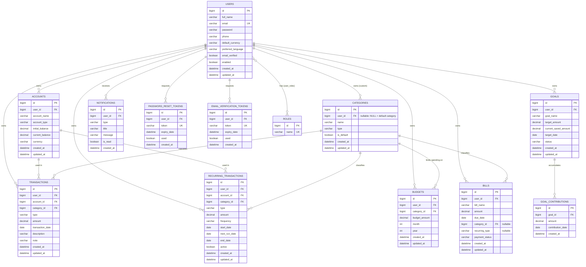

# Phase 2 — Full Database Schema

All 14 tables required by the project spec are created together in this
phase, as JPA entities under `backend/src/main/java/com/smartmoneymanager/backend/entity/`,
mirrored by the reference DDL at `backend/src/main/resources/db/full_schema.sql`.

From Phase 3 onward, **no new tables are added**. Later phases only add
Repository / Service / DTO / Mapper / Controller layers on top of this
schema. Any genuine future schema change will be called out explicitly as
an exception rather than applied silently.

## ER Diagram



## Table-by-table notes

| Table | Relationship shape | Notes |
|---|---|---|
| `users` | 1—N to almost everything | Owns all financial data. `enabled` drives admin enable/disable; hard-delete is intentionally **not** cascaded from here — disabling is the supported admin action. |
| `roles` | M—N with `users` via `user_roles` | Seeded with `ROLE_USER` / `ROLE_ADMIN` in Phase 3 (registration/auth needs to exist first). |
| `user_roles` | pure join table | Generated by `@ManyToMany` + `@JoinTable` on `User.roles`, `ON DELETE CASCADE` both directions. |
| `accounts` | N—1 to `users` | `current_balance` is maintained by service logic (deposits/withdrawals/transfers), `initial_balance` is immutable history. |
| `categories` | N—1 to `users` (nullable) | `user_id IS NULL` marks a default/system category, seeded once and never deletable by users (enforced in the service layer, Phase 5). |
| `transactions` | N—1 to `users`, `accounts`, `categories` | Account-to-account transfers (Phase 4) are modeled as **two** transactions (an EXPENSE on the source account, an INCOME on the destination account) tagged with a "Transfer" category — no separate `transfers` table, matching the fixed field list in the spec. |
| `recurring_transactions` | N—1 to `users`, `accounts`, `categories` | A scheduler (Phase 6) advances `next_run_date` and creates a `transactions` row each time it fires. |
| `budgets` | N—1 to `users`, `categories` | Unique per `(user, category, month, year)`. Spent/remaining/percentage are computed on read from `transactions`, never stored. |
| `goals` | N—1 to `users` | `current_saved_amount` is a running total kept in sync with `goal_contributions`. |
| `goal_contributions` | N—1 to `goals`, cascades on goal delete | Append-only ledger of "Add Money to Goal" actions. |
| `bills` | N—1 to `users`, optional `categories` | `recurring_type = NULL` means one-time; otherwise a reminder/instance is regenerated per period (Phase 8). |
| `notifications` | N—1 to `users`, cascades on user delete | In-app notification center; `is_read` + `(user_id, is_read)` index power the unread-count badge. |
| `password_reset_tokens` / `email_verification_tokens` | N—1 to `users`, cascade on user delete | Multiple rows may accumulate per user over time; only the newest unused, unexpired token is treated as valid (enforced in service logic, Phase 3). `token` is unique + indexed for O(1) lookup. |

## Design decisions

- **No bidirectional collections on `User`/`Account`/`Category`/`Goal`.** Every child entity holds a `@ManyToOne` back to its parent, but parents do not expose `@OneToMany` collections. This avoids accidentally loading a user's entire transaction history through JPA entity graphs — later phases fetch children explicitly through paginated repository queries instead.
- **Money is `DECIMAL(19,4)` / `BigDecimal`**, never floating point, to avoid rounding errors in financial calculations.
- **`FetchType.LAZY` on every `@ManyToOne`** (except `User.roles`, which is small and needed on every authenticated request) to keep queries predictable.
- **Ownership FKs are not `ON DELETE CASCADE`** for accounts/categories/transactions/recurring_transactions/budgets/goals/bills — a user is disabled, not hard-deleted, so cascading destruction from `users` was not needed. Purely dependent child rows (`user_roles`, `notifications`, `*_tokens`, `goal_contributions`) do cascade, since they have no independent meaning without their parent.
- **Cross-reference FKs (transaction → account/category, budget → category, bill → category) have no cascade** — deleting an account or category that is still referenced must go through service-layer validation (Phase 4/5), not a silent DB cascade.
- **Auditing** (`created_at`/`updated_at`) is handled once via two `@MappedSuperclass` bases (`AuditableEntity`, `CreatedOnlyEntity`) and Spring Data's `@EnableJpaAuditing`, rather than repeating `@PrePersist`/`@PreUpdate` on every entity.

## How this was verified

With the `dev` profile active (`spring.jpa.hibernate.ddl-auto=update`) and a
MySQL instance reachable at the configured `DB_HOST`/`DB_PORT`/`DB_NAME`,
starting the backend (`./mvnw spring-boot:run`) creates all 14 tables.
Confirm with:

```sql
SHOW TABLES;
```

Expected output: `accounts, bills, budgets, categories, email_verification_tokens,
goal_contributions, goals, notifications, password_reset_tokens,
recurring_transactions, roles, transactions, user_roles, users` (14 rows).
